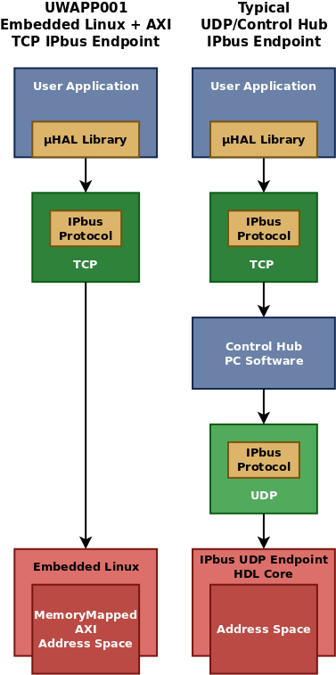

# UW Application Note 001 IPbus Endpoint for Embedded Linux

v1.0 - 15-Jan-2016

## Introduction to µHAL

µHAL is a hardware abstraction library designed as an evolution of the CMS VME
HAL Library into the CMS xTCA environment.  It provides named abstractions for
registers, pipes, and blocks of memory which are mapped at runtime through an
XML based address file.  Accesses to these objects are queued and sent to
the hardware in bursts.

The developers of the µHAL library have implemented the [IPbus protocol][ipbus]
for ethernet-based communication with hardware targets using one of several
underlying transport stacks.

## µHAL Transport Stacks & UWAPP001

### UDP, Control Hub, and the IPbus Firmware Core

µHAL is typically used in CMS is to communicate with hardware via IPbus with
UDP, normally using an optional intermediary piece of software called the IPbus
Control Hub, as shown in the [diagram below](#stack-comparison).

The Control Hub software is used with the IPbus+UDP transport option.  It acts
as a UDP packet router, allowing multiple µHAL clients to communicate with the
target hardware.  The µHAL IPbus implementation also supports the use of UDP
transport without the Control Hub.

The UDP/Control Hub stack is generally used to communicate with an IPbus
Firmware Core, which can be embedded into a user's FPGA design and which
provides a simple UDP endpoint supporting the IPbus protocol which transforms
IPbus requests into FPGA data accesses.

### TCP & UWAPP001

The µHAL library implementation also provides an implementation of the IPbus
protocol using the TCP transport protocol.  This protocol stack does not require
a Control Hub intermediary, as TCP's innate reliability features serve this
purpose without additional software.  This application note demonstrates the
implementation of an embedded IPbus endpoint supporting the IPbus+TCP protocol
option.

### Comparison of Communication Stacks <a id="stack-comparison"/>

# Implementation Details

This application note implements the IPbus 2.0 TCP protocol for an embedded
Linux platform according to the IPbus 2.0 protocol specification and the
µHAL/IPbus source code at version 2.4.2.  It was developed for Xilinx PetaLinux
running on a Zynq-7000 SoC for use with memory-mapped AXI peripherals.

The application note has been developed with and tested on a University of
Wisconsin CTP-7 using Xilinx PetaLinux and communicating with BRAM in a Virtex 7
FPGA connected via a [Xilinx AXI Chip2Chip][axic2c] bridge.

In this configuration a Xilinx AXI Chip2Chip bridge unifies the AXI
interconnects on both chips, allowing the Virtex 7 address space to be directly
mapped into the Zynq processor memory space.  The details of AXI Chip2Chip
implementation are available from Xilinx and outside the scope of this document.
It is entirely possible to use this software within a single Zynq SoC, accessing
BRAM or peripherals directly without the involvement of an AXI Chip2Chip bridge.

## Optional Components

The software implementation provided by this application note can be used on any
appropriate embedded Linux architecture with only minimal modification, however
it is specific to the Wisconsin embedded Linux implementation in two minor and
generally isolated ways: the Memory Service, and an ACL feature.

### Memory Service

The CTP-7 architecture contains a component called the Memory Service, which
provides unprivileged applications access physical memory addresses with support
for error checking.

In order to use this implementation, it will be necessary to replace calls to
`memsvc_open`, `memsvc_read` and `memsvc_write` with whatever memory access
method is appropriate to the target system, such as generic pointer-based
accesses to mmaped memory or another equivalent solution.

### IP Access Control Lists

IP access control lists are used on the CTP-7 to identify which computers
communicate with various services. This optional feature has been included in
the UWAPP001 IPbus+TCP implementation.

It is possible to configure or disable this feature by editing or undefining the
`IP_ACL_PATH` constant in `ipbus.cpp`.  If defined, it should be the path to a
file containing a list of IP addresses or subnets in CIDR format, which are
allowed to access the service.  Connections from other sources will be refused.

## Unsupported Functions

The test client implements all available µHAL functionality, and the endpoint
provided by this application note supports all packets necessary to service this
functionality.  The endpoint implemented in this application note does not
suppport IPbus status packets because none were observed during development and
testing.

[ipbus]: https://svnweb.cern.ch/trac/cactus/export/41398/trunk/doc/ipbus_protocol_v2_0.pdf (IPbus Protocol 2.0 Specification)

[axic2c]: http://www.xilinx.com/products/intellectual-property/axi-chip2chip.html (Xilinx AXI Chip2Chip)
