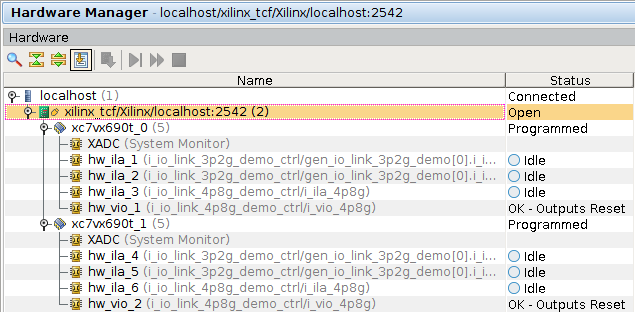
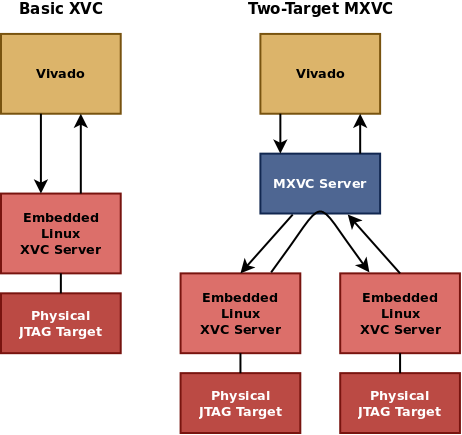

# UW Application Note 002 MXVC - Multitarget XVC

v1.0 - 01-Mar-2016

## Introduction to XVC

XVC, an acronym for Xilinx Virtual Cable, is a protocol created by Xilinx to
allow users to create custom TCP-based servers providing access to JTAG targets.
Its purpose is to simplify the implementation of custom JTAG chain access
methods, allowing maximum flexibility for end-users for whom using a Xilinx JTAG
Cable may not be the best solution.

A notable example of a situation where XVC is useful is for debugging
installations in CMS Point 5, or other testing or production installations where
a PC is not easily available in close proximity to the installation, or where
physical access for debugging is not convenient.  Unlike physical cables
however, Vivado is only able to connect to one XVC target at a time.  This
creates an opportunity for a tool such as MXVC.

## Introduction to MXVC

MXVC, short for Mulitarget XVC, is a tool that takes advantage of the design of
the XVC protocol to allow the interconnection of multiple XVC JTAG chains into a
single virtual chain presented to the Xilinx tools and Vivado.  It is a
specialized tool that can be used to ease certain forms of multi-card
diagnostics and debugging, including situations where the cards to be debugged
are not present in the same physical location.

This technique allows convenient debugging of multi-card interactions such as
high speed serial links between two endpoints.  This would allow, for example,
ILA probes at both ends of a high speed link to be accessed in a consolidated
JTAG environment, effectively using the ethernet as an out-of-band debug path.

### How It Works

Xilinx Virtual Cable operates by running a XVC server on the target system which
provides access to the physical JTAG chain.  Vivado then connects to this XVC
server over TCP to access the remote JTAG chain and perform operations on it.
The XVC protocol is very minimalistic, supporting only the most basic possible
abstraction of JTAG chain access: the ability to shift through the chain.

In the typical XVC use-case the Vivado software connects directly to this XVC
server.  MXVC changes this layout.  Instead of connecting directly to the XVC
target servers, the Vivado software will connect to a MXVC server, which handles
combining the chains and forwarding requests appropriately.  This MXVC server
connects to each of several normal XVC target servers in the same way the Vivado
software would have and routes packets to them as appropriate.

When Vivado issues a shift request, the MXVC server will forward the request to
the first XVC target, and then forward the TDO bits of its response, and the
original TMS bits to the next XVC target, continuing this cycle until the last
target, whose response will be returned to the Vivado software.  In doing so, it
simulates a physical connection between the TDO of the first XVC target, and the
TDI of the second, effectively placing the two into the same JTAG chain.

Using this technique any number of XVC targets may be connected to a single
virtual JTAG chain, however latency/performance is an important consideration,
as each shift must occur in serial, and Vivado sends a great deal of individual
shift requests during normal operation.  In practice, we have found it
reasonable to operate two XVC targets on the same virtual JTAG chain, which is
suitable for the basic multi-card debugging use case.

## Basics of Use

In a normal XVC session, you start the client server on your target system and
connect to it directly with Vivado from the Hardware Manager command line, using
the IP address of the target system.

In a MXVC session, you start the client server on all target systems.  You then
start the MXVC server, supplying it with the address of each target system in
the order it should appear in the chain.  You then connect to the MXVC server
directly with Vivado from the Hardware Manager command line, as if it were a
simple XVC target server.

### Efficiency Limitations of the XVC Protocol

Due to the serial nature of JTAG and by extension the XVC protocol, all requests
must be routed by the MXVC server in a serial fashion.  The result of this is
that latency per request increases in proportionally with the number of devices
added to the MXVC virtual JTAG chain.  Because the Vivado software sends many
small requests as well as large requests, this latency increase adds up such
that best results will be experienced with chains containing two targets.

For maximum performance it is recommended that Vivado and MXVC be run close to
hardware if possible.  While it is possible to forward these connections from a
remote site, which is a great convenience for use in debugging remote
installations at the experimental site or elsewhere, running Vivado and MXVC on
the PCs closest to the cards being debugged will grant much better performance.
This can be made easier through the use of tools such as X Forwarding and VNC.
